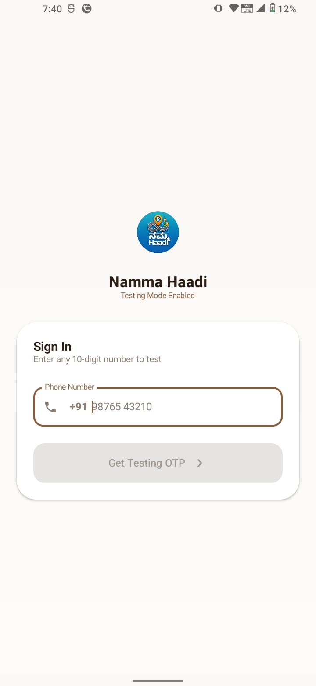
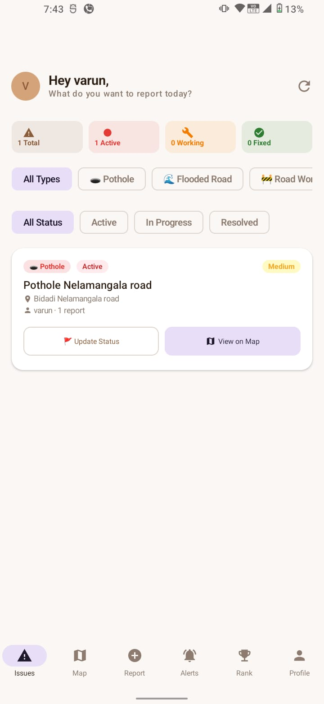
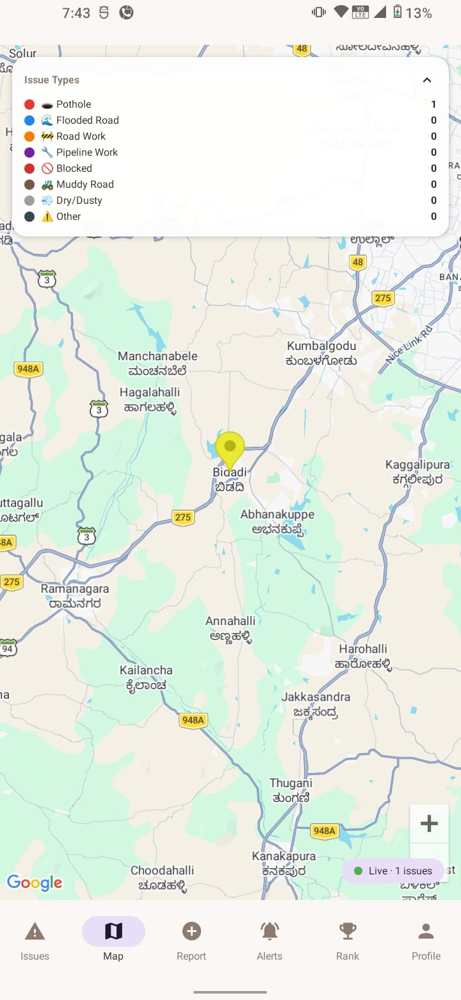
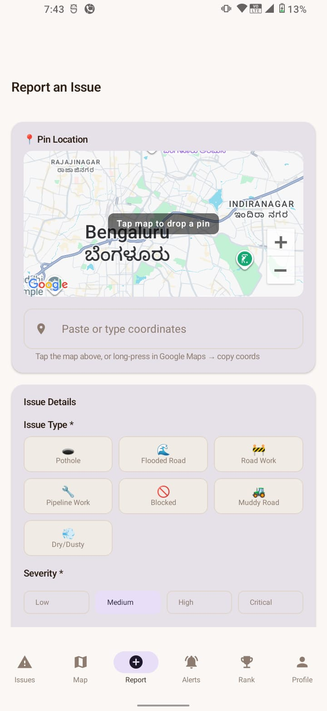
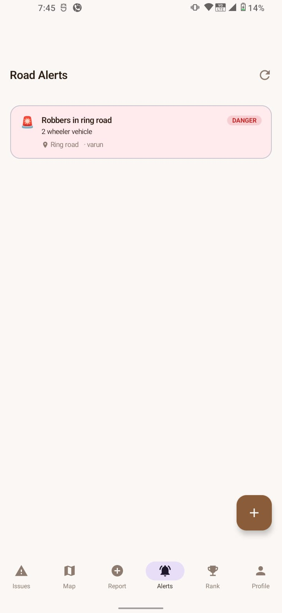

# 🛣️ Namma Haadi - Community Road Guardian

**Namma Haadi** (Our Path) is a community-driven Android application designed to empower citizens to report, track, and monitor road issues in real-time. By bridging the gap between local communities and road maintenance visibility, the app helps create safer and better-connected neighborhoods.

---

## 📸 Screenshots

| Login Page | Home / Issues | Interactive Map |
| :---: | :---: | :---: |
|  |  |  |

| Report Issue | Road Alerts | Leaderboard / Rank |
| :---: | :---: | :---: |
|  |  |  |

| Profile Page |
| :---: |
|  |

---

## 🚀 Key Features

*   **📢 Real-time Reporting**: Quickly report potholes, flooding, road work, or blockages with photos and GPS coordinates.
*   **📍 Interactive Map**: View all community-reported issues on a live Google Map to plan safer routes.
*   **🔔 Community Alerts**: Receive and broadcast urgent road alerts (Danger, Warning, Info) to all users in the area.
*   **🏆 Gamification & Leaderboard**: Earn points and badges for every report and status update. Compete to become a "Road Guardian."
*   **🔄 Status Tracking**: Monitor the progress of issues from "Active" to "In-Progress" and finally "Resolved."
*   **👤 Personal Profile**: Manage your reports, track your contributions, and customize your profile.

---

## 🛠️ Tech Stack

*   **UI Framework**: [Jetpack Compose](https://developer.android.com/jetpack/compose) (100% Declarative UI)
*   **Language**: [Kotlin](https://kotlinlang.org/)
*   **Backend**: 
    *   **Firebase Firestore**: Real-time NoSQL database for reports and users.
    *   **Firebase Auth**: Phone OTP-based authentication simulation.
    *   **Firebase Storage**: Cloud storage for road issue images.
    *   **Firebase Cloud Messaging (FCM)**: Instant push notifications for road alerts.
*   **Architecture**: MVVM (Model-View-ViewModel) with Clean Architecture principles.
*   **Dependency Injection**: [Hilt](https://developer.android.com/training/dependency-injection/hilt-android)
*   **Image Loading**: [Coil](https://coil-kt.github.io/coil/)
*   **Navigation**: [Jetpack Navigation Compose](https://developer.android.com/jetpack/compose/navigation)
*   **Maps**: [Google Maps SDK for Android](https://developers.google.com/maps/documentation/android-sdk/overview)

---

## 📦 Setup & Installation

### 1. Prerequisites
*   Android Studio Ladybug (or newer)
*   A Firebase Project
*   Google Maps API Key

### 2. Configuration
1.  **Clone the repository:**
    ```bash
    git clone https://github.com/your-username/namma-haadi-android.git
    ```
2.  **Firebase Setup:**
    *   Create a project in the [Firebase Console](https://console.firebase.google.com/).
    *   Add an Android App with package name `com.nammahaadi.app`.
    *   Download `google-services.json` and place it in the `app/` directory.
    *   Enable **Firestore**, **Authentication (Phone)**, and **Storage**.
3.  **Google Maps API:**
    *   Get an API Key from the [Google Cloud Console](https://console.cloud.google.com/).
    *   In `app/build.gradle.kts`, replace the `GOOGLE_MAPS_API_KEY` placeholder with your real key.

### 3. Build & Run
*   Sync the project with Gradle files.
*   Run the app on a physical device or emulator.
*   **Note:** The app is currently in **Testing Mode**. You can login with any 10-digit number and use **`123456`** as the OTP.

---

## 🤝 Contributing

1.  Fork the Project
2.  Create your Feature Branch (`git checkout -b feature/AmazingFeature`)
3.  Commit your Changes (`git commit -m 'Add some AmazingFeature'`)
4.  Push to the Branch (`git push origin feature/AmazingFeature`)
5.  Open a Pull Request

---

## 📄 License

Distributed under the MIT License.

---

## ✉️ Contact

Varun - [your-email@example.com]  
Project Link: [https://github.com/your-username/namma-haadi-android](https://github.com/your-username/namma-haadi-android)
